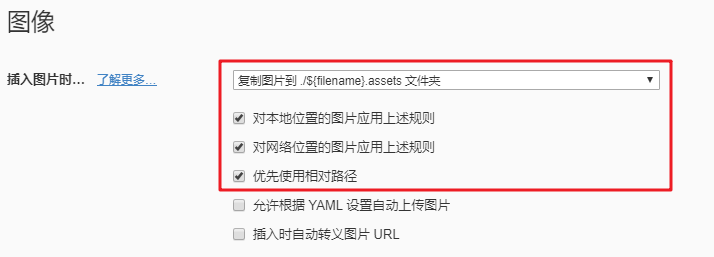
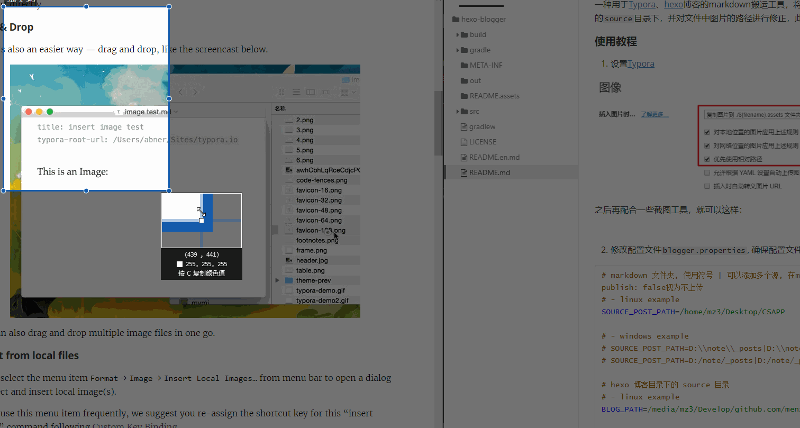
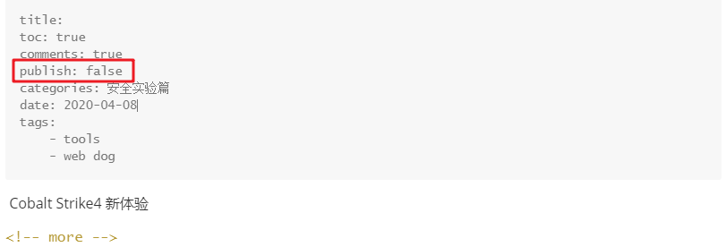

# hexo-blogger

#### 介绍
一种用于[Typora](https://www.typora.io/)、[hexo](https://hexo.io/)博客的markdown搬运工具，将笔记markdown文件搬运到`hexo`的`source`目录下，并对文件中图片的路径进行修正，此后告别博客图床，[下载链接](https://github.com/white3/hexo-blogger/releases/tag/1.0)。

#### 使用教程

1. 设置[Typora](https://www.typora.io/)



之后再配合一些截图工具，就可以这样：



2. 修改配置文件`hexo-blogger.properties`, 确保配置文件与`hexo-blogger.jar`在同一目录

```properties
# markdown 文件夹, 使用符号 | 可以添加多个源, 在markdown文件YAML头中插入 publish: false视为不上传
# - linux example
SOURCE_POST_PATH=/home/mz3/Desktop/CSAPP

# - windows example
# SOURCE_POST_PATH=D:\\note\\_posts|D:\\note\\_posts1|...
# SOURCE_POST_PATH=D:/note/_posts|D:/note/_posts1|...

# hexo 博客目录下的 source 目录
# - linux example
BLOG_PATH=/media/mz3/Develop/github.com/menzel3.fun/source

# - windows example
# BLOG_PATH=E:\\github.com\\menzel3.fun\\source
# BLOG_PATH=E:/github.com/menzel3.fun/source

# 在 BLOG_PATH 目录下, 用于存放图片的文件夹, 通常为 images
BLOG_IMAGE_ABSTRACT_ROOT=/images

# 在 BLOG_PATH 目录下, 用于存放 markdown 的文件夹, 也是 hexo 下的markdown存放处
BLOG_POST_ABSTRACT_ROOT=/_posts

# markdown 文件的编码
MARKDOWN_CHARSET=UTF-8

# 是否打印移动的 markdown 文件
PRINT_FILE=true
```

3. 执行命令`java -jar hexo-blogger.jar`即可执行搬运

#### 使用说明

1.  本人的使用方法是，在博客下写了一个`update.sh`与`local_test.sh`

```sh
# local_test.sh
java -jar hexo-blogger.jar
hexo clean && hexo s -g


# update.sh
java -jar hexo-blogger.jar
hexo clean && hexo g -d
```

2. 使用的时候，我偏好于为项目创建文件夹，例如：

   1. `mkdir 基于xxx智能控制系统`

   2. 将项目经验、过程以及自己学到新姿势通过markdown记录

   3. 对于不想上传的markdown使用`publish: false`即可（注意：不填`publish`等同于填写`publish: true`），像这样：

      

3. 每完成一个项目，我便将项目路径写入配置文件`hexo-blogger.properties`

```properties
SOURCE_POST_PATH=/home/mz3/Desktop/CSAPP | /home/mz3/Desktop/基于xxx智能控制系统 | ...
```
